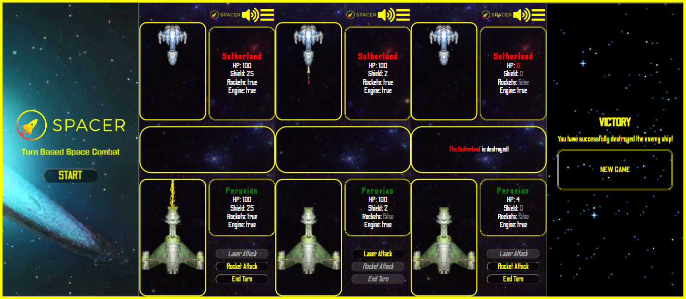

<h1><a src="http://spacer.rf.gd/" alt="">Spacer</a>| Turn Based Space Combat</h1>
<h2>Taks Overview</h2>

The game Spacer is a turn based video game which was made by me while I was learning JavaScript.

 

<h2>Design</h2>

The design is inspired by Star Wars and the game FTL, which can be found on Steam. The animations were made by me.

<h2>Technologies</h2>

For this project the following tecnologies were used:

<ul>
    <li>
HTML - Used to create the markup of the page.

    </li>
        <li>
CSS - Sass was used in order to streamline and simplify the styling of the page.

    </li>
</ul>
